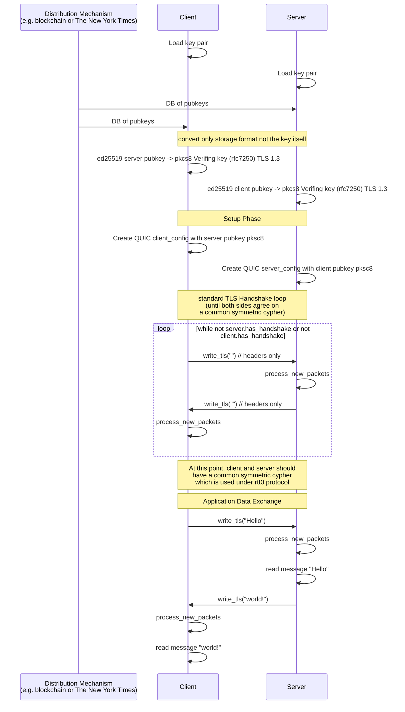

# TLS Raw Public Key (RPK) Implementation

This library implements TLS 1.3 with Raw Public Key (RPK) authentication using ed25519 keys. Instead of using X.509 certificates, this implementation uses raw public keys for mutual authentication between client and server.

## How it Works

The implementation uses ed25519 keys for both client and server authentication. Each party maintains a whitelist of trusted public keys and verifies the peer's identity during the TLS handshake.

### Connection Flow

The following sequence diagram illustrates the TLS handshake and data exchange process:

